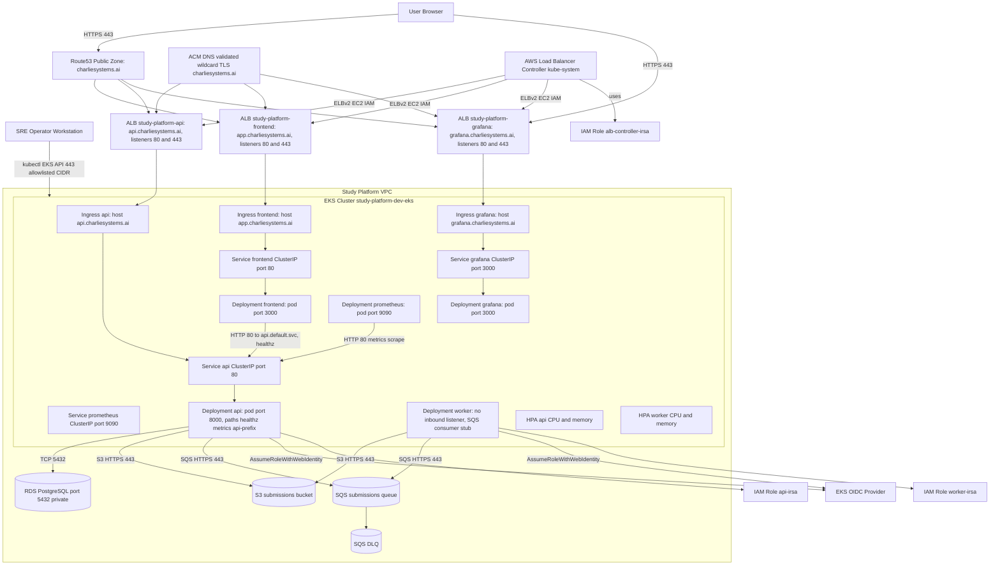

# Resilient Study Platform Architecture

This document is the system architecture reference for the `django-study-platform` deployment in AWS (`dev`, `us-west-1`).

It is written for deep operational review (Principal SRE level): component boundaries, trust model, runtime topology, data/control paths, ports, and failure domains.

---

## 1) Scope and Intent

- **Platform goal:** reliability-first asynchronous study submission system.
- **Primary workloads:** frontend (Next.js), API (Django/DRF), worker (SQS consumer stub today), observability (Prometheus + Grafana).
- **Primary cloud footprint:** VPC + EKS + RDS + S3 + SQS + IAM IRSA + Route53 + ACM + ALB ingress.
- **Security posture highlights:**
  - TLS termination at internet-facing ALBs using ACM.
  - Ingress CIDR allowlist currently set to `98.51.205.17/32`.
  - IRSA-based AWS API access from pods (no static AWS keys in pods).
  - RDS not publicly accessible.

---

## 2) High-Level Topology (Mermaid)

---

## 3) Service and Endpoint Inventory

### Public endpoints

- **Frontend:** `https://app.charliesystems.ai`
  - ALB listener ports: `80` (redirect), `443` (TLS)
  - Backend: `frontend` service port `80` -> pod `3000`
- **API host:** `https://api.charliesystems.ai`
  - `GET /healthz/` returns health (`200`)
  - API routes under `/api/`
  - ALB listener ports: `80` (redirect), `443` (TLS)
  - Backend: `api` service port `80` -> pod `8000`
- **Grafana:** `https://grafana.charliesystems.ai`
  - Dashboard path example: `/d/study-platform-api/study-platform-e28094-django-api?...`
  - ALB listener ports: `80` (redirect), `443` (TLS)
  - Backend: `grafana` service port `3000` -> pod `3000`

### Cluster-local endpoints

- `api.default.svc.cluster.local:80`
  - Used by frontend for health check and by Prometheus for `/metrics`.
- `prometheus.monitoring.svc.cluster.local:9090` (cluster internal)
- `grafana.monitoring.svc.cluster.local:3000` (cluster internal)

### API process routes (Django)

- `GET /healthz/`
- `GET /metrics` (via `django-prometheus`)
- `... /api/*` (app routes from `api.urls`)

---

## 4) Network Ports and Protocols

### Inbound (internet-facing)

- ALB listeners:
  - `80/tcp` -> redirect to `443`
  - `443/tcp` -> TLS termination (ACM)
- Ingress CIDR restriction:
  - `alb.ingress.kubernetes.io/inbound-cidrs: 98.51.205.17/32`

### East-west in cluster

- Frontend pod -> API service: `80/tcp` (HTTP)
- Prometheus -> API service: `80/tcp` (`/metrics`)
- Service target ports:
  - API pod `8000/tcp`
  - Frontend pod `3000/tcp`
  - Grafana pod `3000/tcp`
  - Prometheus pod `9090/tcp`

### AWS service egress

- Pods -> AWS APIs over HTTPS `443/tcp`
  - S3
  - SQS
  - CloudWatch Logs (if used by app/runtime)
- API/worker -> RDS: `5432/tcp`

### Control plane

- Operator (`kubectl`) -> EKS API endpoint: `443/tcp` (public endpoint CIDR-scoped + private endpoint enabled)

---

## 5) Data Flow and Processing Model

### Submission path (target architecture)

1. Client sends submission request to API.
2. API persists raw payload/object to S3.
3. API enqueues message to SQS.
4. Worker consumes and processes asynchronously.
5. Results/state persisted to RDS.

### Current worker state

- Worker deployment currently runs a **stub loop** (`sleep infinity`) and does not yet execute real queue consumption logic.
- IAM and environment dependencies for real SQS processing are already scaffolded.

---

## 6) IAM and Trust Boundaries

### IRSA roles

- **API role**
  - S3: list/get/put/delete on submissions bucket.
  - SQS: send + queue attribute reads.
  - CloudWatch logs writes.
- **Worker role**
  - S3: list/get/put.
  - SQS: receive/delete/change visibility/get attributes.
  - CloudWatch logs writes.
- **ALB controller role**
  - ELBv2/EC2 permissions required to create/manage ALBs, target groups, listeners, SG rules, etc.

### Trust model

- OIDC federated trust on service account subject (`system:serviceaccount:<ns>:<sa>`).
- No long-lived static AWS credentials in workload manifests.

---

## 7) Terraform Resource Model (dev environment)

### Provisioned modules

- `vpc`: VPC + public/private subnets + single NAT gateway.
- `eks`: cluster + managed node group + core addons (coredns, kube-proxy, vpc-cni) + IRSA enabled.
- `rds`: PostgreSQL in private subnets; SG allows only EKS nodes on 5432.
- `s3`: submissions bucket.
- `sqs`: queue + DLQ.
- `iam_irsa`: roles/policies for API, worker, ALB controller.
- `public_https`: wildcard ACM + Route53 validation + ALB alias records for app/api/grafana.

### DNS and certificate strategy

- Certificate: `*.charliesystems.ai` + `charliesystems.ai` in ACM (`us-west-1`).
- Route53 aliases:
  - `api.charliesystems.ai` -> API ALB
  - `app.charliesystems.ai` -> frontend ALB
  - `grafana.charliesystems.ai` -> Grafana ALB

### Duplicate-zone handling

- `public_hosted_zone_id` variable is used to explicitly pin the active delegated zone when duplicates exist.

---

## 8) Kubernetes Runtime Model

### Namespaces

- `default`: api, worker, frontend workloads.
- `monitoring`: prometheus, grafana workloads.
- `kube-system`: aws-load-balancer-controller, cluster components.

### Scaling

- HPA:
  - API: min 1 / max 10, CPU+memory targets.
  - Worker: min 1 / max 20, CPU+memory targets.
- Frontend currently fixed replica count (no HPA yet).

### Health checks

- API pod probes: `/healthz` on port `8000`.
- Frontend probes: `/` on port `3000`.
- Grafana probes: `/api/health` on port `3000`.

---

## 9) Observability Design

- Prometheus scrapes:
  - itself (`localhost:9090`)
  - Django API (`api.default.svc.cluster.local:80/metrics`)
- Grafana:
  - Provisioned datasources/dashboards via ConfigMaps.
  - Anonymous read-only Viewer enabled for embedding.
  - `GF_SECURITY_ALLOW_EMBEDDING=true`.
  - Root URL set to `https://grafana.charliesystems.ai/`.

---

## 10) Operational Runbook (Critical Paths)

### Deploy / reconcile path

1. `terraform apply` in `infra/environments/dev`
2. `kubectl apply -k k8s/base`
3. `kubectl apply -k k8s/observability`
4. `./scripts/apply-acm-certificate-to-ingress.sh` (if certificate ARN changes)

### Validate secure ingress

- `curl -I http://api.charliesystems.ai` -> `301` to `https://...`
- `curl -I https://api.charliesystems.ai/healthz/` -> `200`
- `curl -I https://app.charliesystems.ai/` -> `200`
- `curl -I https://grafana.charliesystems.ai/` -> `200`

### Validate control/data planes

- `kubectl get deploy,pods,svc,ingress -A`
- `kubectl get hpa -A`
- `terraform output` (confirm ACM/domain outputs, queue/bucket/roles)

---

## 11) Known Gaps / Risks

- Worker business logic is still stubbed; queue processing throughput/retry/idempotency behavior is not yet implemented in runtime path.
- Ingress CIDR is a single public IP (`98.51.205.17/32`); this is restrictive and operationally brittle for team/CI access.
- API returns `404` at `/` by design; health and API routes are valid.
- No CDN/WAF layer yet; ALBs are direct public edge.

---

## 12) Source of Truth Files

- Terraform environment: `infra/environments/dev/*`
- Public HTTPS module: `infra/modules/public_https_dns/*`
- IAM policies: `infra/modules/iam/*`
- App manifests: `k8s/base/*`
- Observability manifests: `k8s/observability/*`
- Django routes: `backend/config/urls.py`

---

## 13) Architecture Decision Record (ADR)

Architecture decisions are maintained as individual ADR files for readability and change tracking:

- `adr/0001-eks-managed-node-groups.md`
- `adr/0002-alb-ingress-controller.md`
- `adr/0003-acm-wildcard-https.md`
- `adr/0004-async-sqs-submission-pipeline.md`
- `adr/0005-irsa-pod-aws-authz.md`
- `adr/0006-grafana-anonymous-viewer-embed.md`
- `adr/0007-ingress-cidr-restrictions.md`

